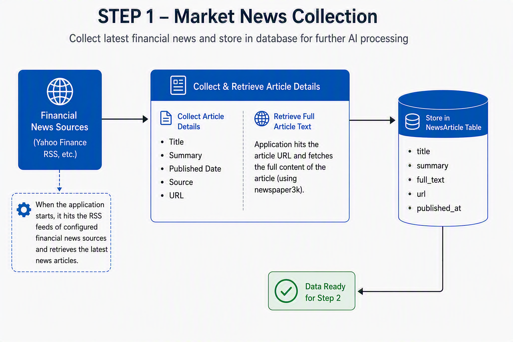
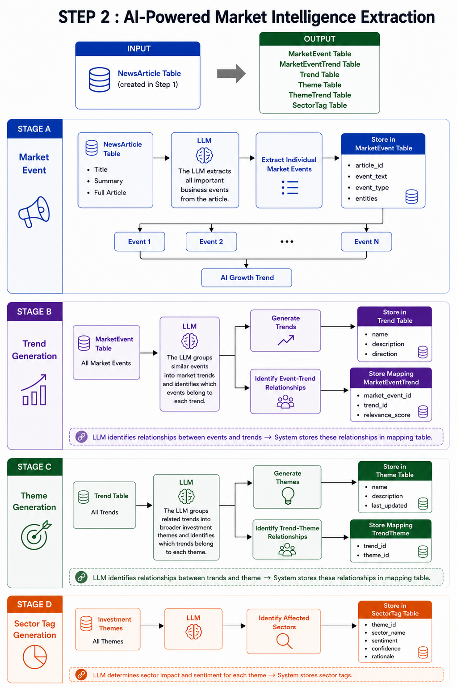
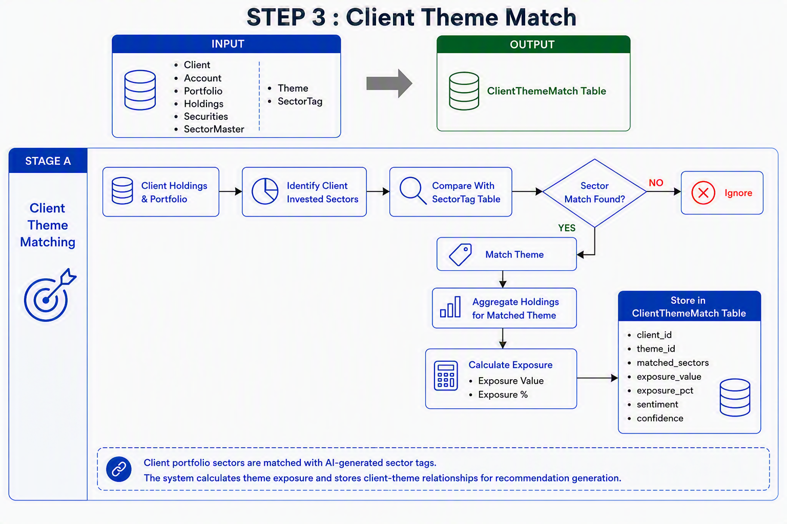
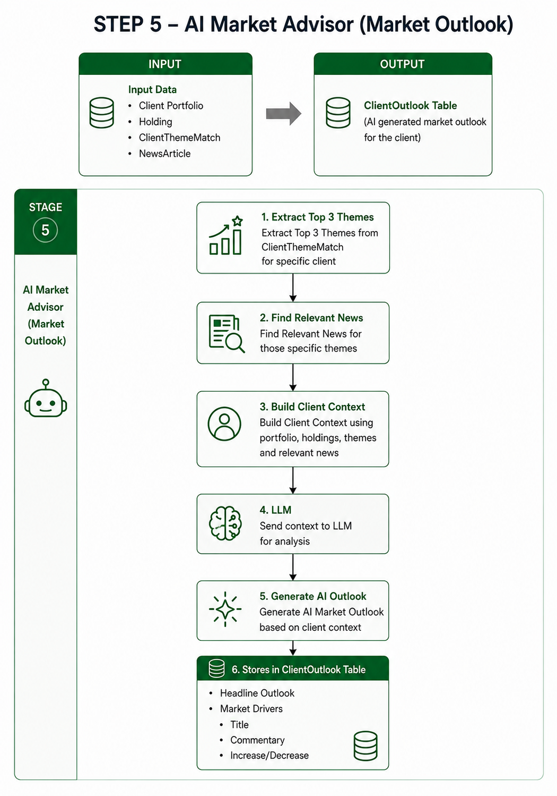
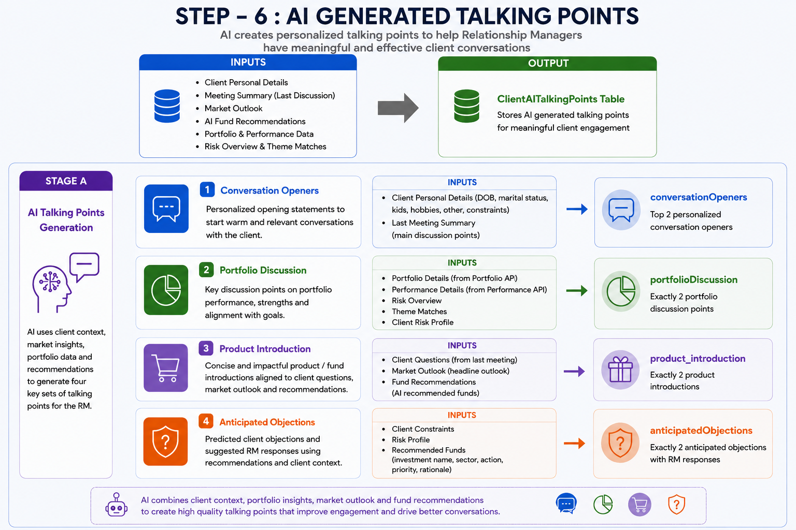
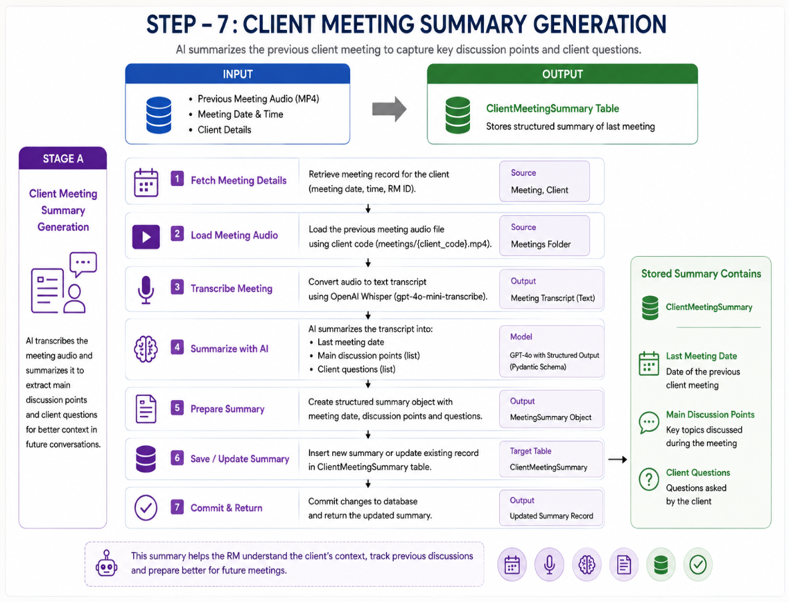
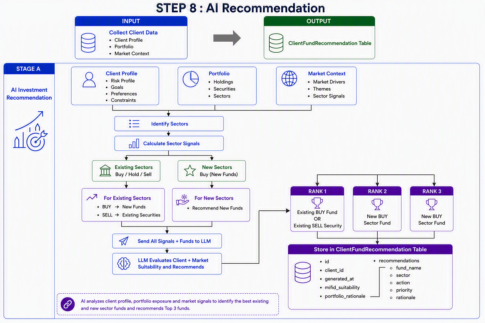

## AI Working Flows

### Step 1 – Market News Collection

 

### Step 2 – AI-Powered Market Intelligence Extraction

 

### Step 3 – Client Theme Match

 

### Step 5 – AI Market Advisor

 

### Step 6 – AI Generated Talking points

 

### Step 7 – Client Meeting Summary Generation

 

### Step 8 – AI Recommendation

 

